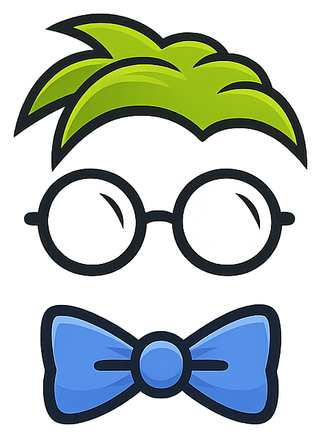

<p align="center">
  
</p>

<h1 align="center">GLAVEN GAME</h1>

<p align="center">
  Digital Gloomhaven board game built with SwiftUI and SpriteKit.<br />
  Hex-grid scenario maps, automated monster AI, interactive player turns,<br />
  attack modifier decks, and full combat resolution — all running natively on Apple platforms.
</p>

---

## What Is This?

GlavenGame is a digital implementation of Gloomhaven's tactical board game. Players place characters on a hex grid, select ability cards, and execute turns — while monsters move, focus, and attack automatically using Gloomhaven's AI rules.

**This isn't GlavenApp** (the companion/helper app). GlavenGame is a playable game with a visual hex board, animated piece movement, and automated combat.

## Features

- **Hex Board** — SpriteKit-rendered hex grid with scenario maps, room reveals, doors, traps, hazardous terrain, and overlays
- **Monster AI** — Faithful Gloomhaven focus/movement algorithm with pathfinding, line of sight, and multi-target attacks
- **Summon AI** — Automated summon turns using monster AI with inverted friend/foe, drawing from owner's modifier deck
- **Interactive Player Turns** — Move characters on the board, select attack targets, play ability cards with hex-based AoE
- **Combat Resolution** — Attack modifier draws with advantage/disadvantage, shield, pierce, retaliate, poison, conditions
- **Scenario System** — Load scenarios from edition data, progressive room reveals via doors, victory/defeat conditions
- **3 Editions** — Gloomhaven, Frosthaven, and Jaws of the Lion with full scenario and monster data
- **Character Management** — Health, XP, gold, conditions, summons, ability hand management, perks, enhancements
- **Attack Modifier Decks** — Per-character and monster decks with bless/curse, perk modifications, animated card draws
- **Visual Theming** — Edition-specific fonts and colors, parchment backgrounds, light/dark mode

## Requirements

- macOS 14+ (Sonoma) or iPadOS 17+
- Xcode 16+ (includes Swift 6 toolchain)
- [xcodegen](https://github.com/yonaskolb/XcodeGen) (for Xcode project generation)

## Building and Running

### Swift Package Manager (command line)

```sh
swift build
```

### Xcode (recommended for iPad development)

```sh
# Regenerate the Xcode project from project.yml
xcodegen generate

# Open in Xcode, select a scheme, pick a simulator, Cmd+R
open GlavenGame.xcodeproj
```

The Xcode project is generated by xcodegen and excluded from version control. Run `xcodegen generate` after adding or removing source files.

## Project Structure

```
GlavenGame/
  GlavenGame.swift             # App entry point
  ContentView.swift            # Root navigation
  Board/                       # Board UI and turn execution
    BoardCoordinator.swift     # Bridges SpriteKit scene ↔ SwiftUI state
    BoardScene.swift           # SpriteKit hex grid rendering and animations
    BoardView.swift            # SwiftUI overlay (character panel, HUD, turn UI)
    PlayerTurnController.swift # Interactive player turn execution
    MonsterTurnController.swift# Automated monster turn execution
    SummonTurnController.swift # Automated summon turn execution
  Engine/                      # Game logic and AI (no UI dependencies)
    MonsterAI.swift            # Gloomhaven monster focus/movement/attack AI
    SummonAI.swift             # Summon AI (inverted friend/foe monster AI)
    CombatResolver.swift       # Attack resolution with modifiers and conditions
    BoardState.swift           # Hex grid state (cells, pieces, doors, overlays)
    BoardBuilder.swift         # Constructs board from scenario map data
    Pathfinder.swift           # Hex grid A* pathfinding
    LineOfSight.swift          # Hex-based line of sight
    HexCoord.swift / HexCell.swift / PieceID.swift
  Managers/                    # Game state orchestration
  Models/                      # Data models, enums, protocols
  Views/                       # SwiftUI views (setup, menus, dialogs)
  Utilities/                   # Image loading, fonts, sound, theming
  Resources/
    EditionData/{gh,fh,jotl}/  # Bundled JSON game data
    ScenarioMaps/              # Hex map data for scenarios
    Fonts/ Images/ Sounds/
Package.swift                  # SPM package definition
project.yml                    # xcodegen project spec
```

## Copyright / License

Gloomhaven and all related properties, images and text are owned by [Cephalofair Games](https://cephalofair.com).

Assets/Data used:

- [Creator Pack by Isaac Childres](https://boardgamegeek.com/thread/1733586/files-creation) CC BY-NC-SA 4.0
- [Worldhaven](https://github.com/any2cards/worldhaven)
- [Nerdhaven Images](https://drive.google.com/drive/folders/16wSfzvrSlpbGY8l4eWn8dnHjDUF7A2_e)
- [X-haven Assistant](https://github.com/Tarmslitaren/FrosthavenAssistant)
- [Gloomhaven Item DB](https://github.com/heisch/gloomhaven-item-db)
- [Virtual Gloomhaven Board](https://github.com/PurpleKingdomGames/virtual-gloomhaven-board)
